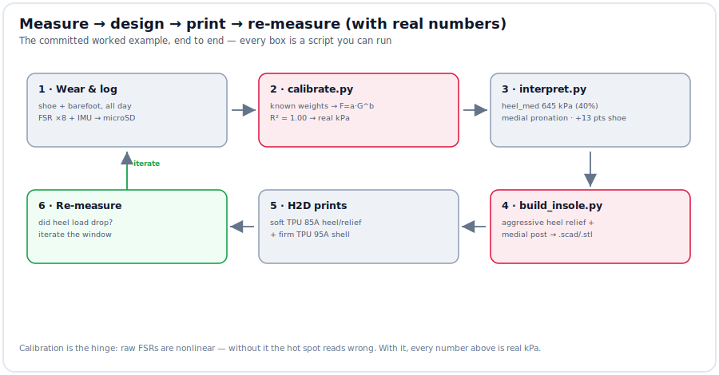
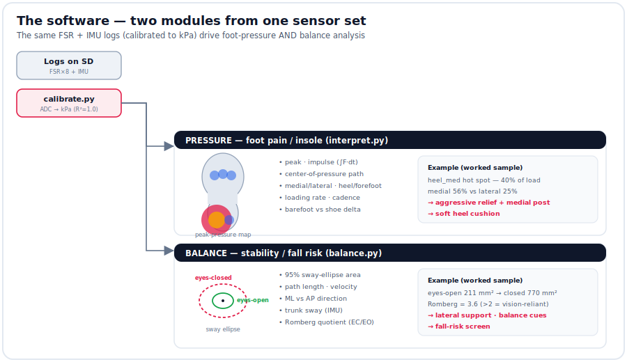

# A $100 wearable that does what a $5k+ gait lab does — all day

**biomech-pressure-lab** turns a hobby 3D printer + ~$100 of electronics into a
wearable that (1) finds exactly where your foot is overloaded and **prints a
custom relief insole from the data**, and (2) doubles as a **balance / fall-risk
screen** — worn all day, not for one 10-second snapshot in a clinic.

---

## The problem
- **Foot pain** is treated by feel: heel pads, generic orthotics, "try this and
  see." Clinical **pressure plates** that actually *measure* load cost **$5k–40k**,
  live in a clinic, and capture a few steps.
- **Balance issues** (fall risk, vestibular/proprioceptive) are screened on
  **force plates / posturography rigs** — same story: expensive, in-clinic, brief.
- Neither follows you into a real day, a real shoe, a real floor.

## The solution
One small **ankle pod** (ESP32 + battery + microSD + motion sensor) and a
**paper-thin sole** with 8 force sensors. Electronics ride at the ankle — nothing
bulky underfoot. Log a normal day (shoe *and* barefoot), pull the card at night,
and the software tells you where the load is and **prints the fix**.

## It works today — a committed worked example
Run on a synthetic day of data (in [`sample/`](sample/README.md), reproduces in ~5 s):
- Calibration fits real physics → **R² = 1.00**, readings in **real kPa** (not "relative").
- Hot spot at **heel_med — 645 kPa, 40 % of load**; **medial pronation**; the *shoe
  adds +13 pts* vs barefoot.
- `build_insole.py` reads those findings and emits a **print-ready insole**
  ([relief_insole.stl](hardware/relief_insole.stl)) — aggressive medial-heel relief,
  medial post, heel cushion — no hand-editing.

## Two capabilities, one rig
| | Pressure module | Balance module |
|---|---|---|
| **For** | foot pain / custom insoles | balance issues / fall risk |
| **Measures** | peak, impulse, COP, medial/lateral, cadence (kPa) | sway area, velocity, ML/AP, **Romberg** |
| **Worked-example result** | heel_med 645 kPa → aggressive relief insole | eyes-open 211 → closed 770 mm², **Romberg 3.6** |
| **Output** | a printed relief insole | a fall-risk screen + device class |

## Cost
| | ~$ |
|---|---|
| Electronics rig (ESP32-S3, 8× FSR, mux, IMU, microSD, LiPo, charger, ribbon) | **~100** |
| Bambu **H2D** + TPU High-Flow kit (prints the insoles + the pod) | ~1,730 |
| TPU filament (soft 85A + firm 95A) | ~74 |
| **Per printed insole after that** | ~cents |

## Status
- ✅ **Software + design: done & verified** — firmware (all-day logger), calibration,
  pressure + balance analysis, the auto-insole generator, print-ready STLs, and a
  self-demonstrating worked example are all committed.
- ⏳ **Physical build**: order the rig, print the parts, solder, calibrate with known
  weights — once the printer lands. See [docs/prototype_status.md](docs/prototype_status.md).

> **Not a medical device** — a design / screening / training aid. Pair with a
> podiatrist or clinician for pain and fall risk. DIY FSR insoles validate to
> r ≈ 0.87 vs professional systems — plenty for *relative* mapping and trend.
