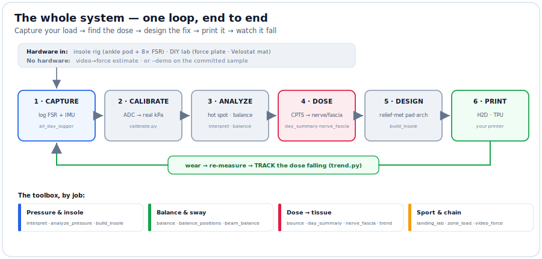
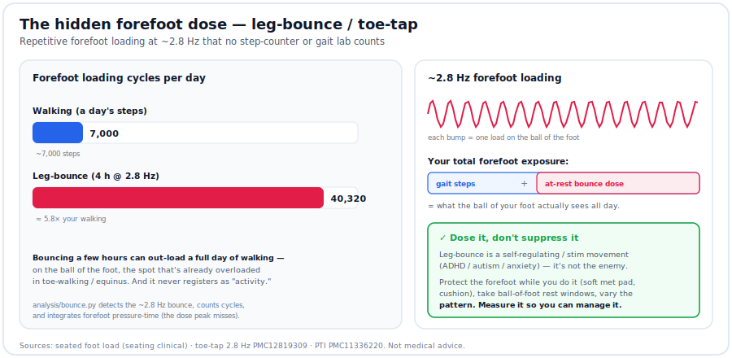
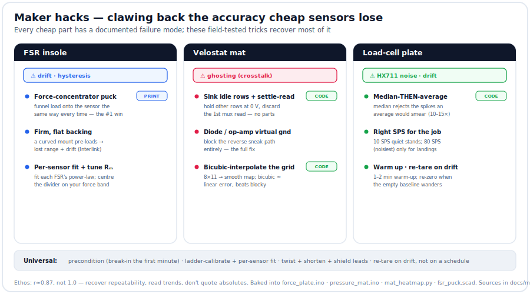

# Personal Biomechanics Lab

Measure how your foot is loaded — all day — and turn that into a **custom 3D-printed insole**
plus a plain-language read on **which tissues the load is stressing**. A ~$100 wearable and a
printer doing what a $5k+ gait lab does, at home.

> **Part of the biomech-lab family — the hardware / pressure side.** Its sibling **`biomech-lab`**
> covers markerless *motion* (webcam→OpenSim, DICOM/MRI bone geometry). **This** repo is the
> **build-your-own** side: a printed insole, an optional smart-insole sensor rig, and a DIY force
> plate + pressure mat you fabricate yourself.
>
> 🎤 One-pager pitch: [**PITCH.md**](PITCH.md) · 🩺 *A design & screening aid, not a medical device.*

---

## The flow — one loop, end to end



Everything in the repo is a stage of one loop:

| # | Stage | Does | Tool |
|---|---|---|---|
| 1 | **Capture** | log foot pressure (8× FSR) + motion, all day | [`firmware/all_day_logger`](firmware/all_day_logger/all_day_logger.ino) |
| 2 | **Calibrate** | turn raw ADC into real **kPa** | [`calibrate.py`](analysis/calibrate.py) |
| 3 | **Analyze** | hot spot, pronation, cadence, balance/sway | [`interpret.py`](analysis/interpret.py) · [`balance.py`](analysis/balance.py) |
| 4 | **Dose** | the all-day **CPTS** load → which **nerves & fascia** it stresses | [`day_summary.py`](analysis/day_summary.py) → [`nerve_fascia.py`](analysis/nerve_fascia.py) |
| 5 | **Design** | a relief window + met pad + arch that follow the findings | [`build_insole.py`](hardware/build_insole.py) |
| 6 | **Print** | soft cushion + firm shell in one part | your **multi-material printer** |
| ↻ | **Track** | wear it, re-measure, watch the dose fall week over week | [`trend.py`](analysis/trend.py) |

**Two ways in, one destination:** Path 1 designs the insole *by feel* (no electronics); Path 2 adds
the sensor rig for *objective data*. **No hardware at all?** Every tool runs on the committed
sample with `--demo`.

---

## What you need to build it

### 🖨️ To PRINT the insole — a multi-material 3D printer  *(the one physical must-have)*
The insole is a **soft cushion + firm shell in a single print**, so it needs a printer that runs
two materials (e.g. a **Bambu Lab H2D** with the TPU High-Flow kit). This is the piece the whole
Path-1 workflow depends on.

| Part | Why |
|---|---|
| **Bambu Lab H2D** (or any multi-material printer) | prints soft cushion + firm shell in one insole |
| **TPU High-Flow kit** | nozzles tuned for flexible TPU |
| **Soft / foaming TPU** (e.g. VarioShore) | the squishy heel cushion that won't bottom out |
| **Firm TPU 95A** | the support shell |
| **PLA / PETG** | optional — enclosures, the DIY-lab frames, the FSR pucks |

Full list + links: [docs/parts_list.md](docs/parts_list.md).

### 🔬 To MEASURE (optional) — the sensor rig or the DIY lab
- **Smart-insole rig** (~$70–120): ESP32-S3 + 8× FSR + mux + IMU + microSD + LiPo. Gives a real
  hot-spot map and before/after proof. → **Path 2** below.
- **DIY lab instruments** (~$150): a **load-cell force plate** (vertical GRF ×BW) and a **Velostat
  pressure mat** (full-foot map) you print + wire. → [docs/build_lab.md](docs/build_lab.md).

---

## ▶️ Try it now — no hardware needed
[`sample/`](sample/README.md) runs the **entire pipeline on a synthetic day** (~5 s, every output
committed): calibrate → real kPa → hot spot → **an insole the software designs itself** → the
all-day dose → nerve/fascia read → a balance screen.

<p align="center">
  
</p>

**Worked result:** hot spot **heel_med (645 kPa, 40% of load)**, medial pronation, heel-dominant; the
shoe *adds* +13 pts vs barefoot → an **aggressive medial-heel relief insole with arch support**
([`hardware/relief_insole.stl`](hardware/relief_insole.stl)); the all-day dose flags **plantar fascia /
Baxter's / tibial** (tell-apart by time-of-day); balance **Romberg 3.6** (vision-reliant).

```bash
cd analysis
python make_sample_data.py --out ../sample                                      # fake a day
python calibrate.py ../sample/cal_points.csv --out ../sample/calibration.json --r-fixed 1000
python interpret.py "../sample/sample_day_*.csv" --calibration ../sample/calibration.json --out ../sample/results
python nerve_fascia.py --logs "../sample/sample_day_*.csv" ../sample/sample_seated_bounce.csv \
    --calibration ../sample/calibration.json --walk-hours 10 --bounce-hours 4 --out ../sample/results
cd ../hardware && python build_insole.py --spec ../sample/results/insole_spec.json --out .
```
Full walkthrough: [sample/README.md](sample/README.md) · both paths step-by-step: [docs/quickstart.md](docs/quickstart.md).

---

## 🖨️ Path 1 — printer-first (start here)
No electronics, no soldering. You already know where it hurts.
1. **Scan** your orthotic → STL (iPhone photogrammetry: Scaniverse/Polycam) — [docs/insole_print_spec.md](docs/insole_print_spec.md) §1.
2. **Mark** the sore spot on the scan.
3. **Design** the insole (soft heel cushion + firm shell + a **relief pocket** there) — or let
   [`build_insole.py`](hardware/build_insole.py) generate it, **fitted to your foot** ([how](docs/fit_to_your_foot.md)).
4. **Print** in TPU on the H2D (soft + firm in one part).
5. **Wear it**, nudge the window/density by feel, **reprint.** That's the loop — no measurement hardware.

---

## 🔬 Path 2 — the sensor rig (optional, advanced)
Add this only when you want to *measure* the hot spot instead of placing it by feel. The full
all-day, **barefoot-and-shoe** build is spec'd end-to-end in
[**docs/path2_tracking_build.md**](docs/path2_tracking_build.md) — electronics ride in an **ankle
pod** ([`hardware/ankle_pod.scad`](hardware/ankle_pod.scad)), not underfoot.


<details>
<summary><b>Sensor-rig BOM, wiring, FSR map & data format</b></summary>

**BOM (~$70–120):** ESP32-S3 DevKitC-1 · 8× **FSR402** · **CD74HC4067** 16-ch mux · **BNO085** IMU ·
microSD SPI module · 8× 10 kΩ · LiPo 500 mAh + **TP4056** · EVA/wire/tape.
*(DIY FSR insoles validate to **r ≈ 0.87** vs pro systems — plenty for relative hot-spot mapping.)*
Each part explained: [docs/what-each-part-is-for.md](docs/what-each-part-is-for.md).

**Wiring (ESP32-S3):** mux SIG→GPIO1 (ADC1_CH0); mux S0–S3→GPIO2/3/4/5; IMU SDA/SCL→GPIO8/9;
SD CS/MOSI/SCK/MISO→GPIO10/11/12/13; button→GPIO14; LED→GPIO15. Each FSR:
`3V3 ── FSR ──●── 10kΩ ── GND`, node `●` → a mux channel.

**FSR → foot-zone map** (channel order in firmware/analysis):
```
        toes                  0 heel_med   4 met3
   hallux   met5              1 heel_lat   5 met5
 met1   met3                  2 midfoot    6 hallux
      midfoot                 3 met1       7 toes
 heel_med  heel_lat
```

**Data (CSV, ~50–100 Hz):** `t_ms,mode,phase,fsr0..fsr7,qw,qx,qy,qz,ax,ay,az,vbat`
(`phase` = walk/stand/bounce/other; short-press cycles it so a day segments for the dose model).
</details>

---

## 🧰 The toolbox — `analysis/`, by job
Every script runs standalone with `--demo`. Grouped by what you're asking:

| Job | Scripts |
|---|---|
| **Calibration & data** | [`calibrate.py`](analysis/calibrate.py) (fit ADC→kPa) · [`calib.py`](analysis/calib.py) (shared model) · [`make_sample_data.py`](analysis/make_sample_data.py) |
| **Pressure & insole** | [`interpret.py`](analysis/interpret.py) (findings + insole directives) · [`analyze_pressure.py`](analysis/analyze_pressure.py) (peak/impulse/CoP plots) · [`zone_load.py`](analysis/zone_load.py) (per-met vs cited norms) |
| **Balance & sway** | [`balance.py`](analysis/balance.py) (sway, Romberg) · [`balance_positions.py`](analysis/balance_positions.py) (mCTSIB, single-leg, LOS) · [`beam_balance.py`](analysis/beam_balance.py) (athlete/beam) · [`landing_lab.py`](analysis/landing_lab.py) |
| **All-day dose → tissue** | [`bounce.py`](analysis/bounce.py) (the at-rest forefoot dose) · [`day_summary.py`](analysis/day_summary.py) (day → peak/PTI/cycles) · [`nerve_fascia.py`](analysis/nerve_fascia.py) (CPTS → structures) · [`trend.py`](analysis/trend.py) (dose over weeks) |
| **DIY-lab instruments** | [`mat_heatmap.py`](analysis/mat_heatmap.py) (Velostat map) · firmware: [`force_plate`](firmware/force_plate/force_plate.ino) · [`pressure_mat`](firmware/pressure_mat/pressure_mat.ino) |
| **Integrations** | [`integrations/`](integrations/README.md): `video_force` · `apple_watch` · `gait_cue` · `walker` · `api_server` |

---

## 🗺️ Repository map
| Folder | What's in it |
|---|---|
| [`analysis/`](analysis/) | all the Python — the toolbox above |
| [`firmware/`](firmware/) | ESP32 sketches: `all_day_logger`, `smart_insole`, `fsr_calibrate`, `force_plate`, `pressure_mat` |
| [`hardware/`](hardware/README.md) | printable models (`.scad`+`.stl`): insole, ankle pod, sole, force plate, mat, FSR puck + [`build_insole.py`](hardware/build_insole.py) |
| [`refs/`](refs/README.md) | `plantar_norms.json` — the **cited** norms DB (pressures, thresholds, conditions, nerve/fascia structures) |
| [`sample/`](sample/README.md) | the reproducible worked example + committed outputs |
| [`docs/`](docs/README.md) | guides, specs, and the diagram source — **[docs index →](docs/README.md)** |
| [`integrations/`](integrations/README.md) | Apple Watch / cueing glasses / walker / REST API |

---

## 🖼️ Gallery
The system in pictures, grouped. (Diagrams are code-generated — [`docs/make_graphics.py`](docs/make_graphics.py).)

<details open>
<summary><b>Foundations & flow</b></summary>


</details>

<details>
<summary><b>Pressure, insole & conditions</b></summary>


</details>

<details>
<summary><b>Balance & sport</b></summary>


</details>

<details>
<summary><b>The all-day dose → nerves & fascia</b></summary>




</details>

<details>
<summary><b>Build the DIY lab</b></summary>



</details>

---

## ⚠️ Safety & expectations
A **design & screening aid, not a medical device** — pair it with a clinician for pain. FSRs give
**relative, repeatable** pressure (calibrate for kPa; they drift — read trends). The nerve/fascia
read is **screening, not diagnosis** — those structures overlap, and confirming one needs an exam
+ imaging or a diagnostic block. You already have custom orthotics; treat this as tuning on top.
