# Personal Biomechanics Lab

Design and 3D-print your own **custom insole** — a soft cushion + firm shell with a **relief window** under your sore spot — on a Bambu H2D. Optionally, add a DIY sensor rig later to *measure* exactly where the pressure is instead of placing it by feel.

> **Part of the biomech-lab family — the hardware pressure side.** Its sibling repo **`biomech-lab`** covers *markerless motion / joint video analysis* (webcam→OpenSim, DICOM/MRI bone geometry). **This** repo is the **build-your-own** side: a 3D-printed custom insole (and, optionally, a smart insole + pressure plate you fabricate yourself).

> 🎤 **The one-pager pitch:** [**PITCH.md**](PITCH.md) — "a $100 wearable that does what a $5k+ gait lab does, all day."

## 🚦 Start here — pick your path

**🖨️ Path 1 — Printer-first (recommended, simplest).** No electronics, no soldering, no wiring. Scan your orthotic, design an insole with the relief window placed **where it hurts** (you already know), print it in TPU, wear it, tweak by feel, reprint. The fast route to a real custom insole.

**🔬 Path 2 — + Sensor rig (optional, advanced).** *Later*, if you want **objective data** instead of "by feel," add the DIY smart insole (pressure + motion sensors) to measure your hot spot precisely and verify the fix. More parts, wiring, and code.

> ⚠️ **You do NOT need the wires / resistors / ESP32 to make a great insole.** Those are a precision *upgrade* — not a requirement. Path 1 stands on its own.

---

## 📊 How it all fits together
The complete system — capture → calibrate (real kPa) → interpret → print → re-measure:


The wearable hardware — electronics off the foot; swap the sole for shoe vs barefoot:

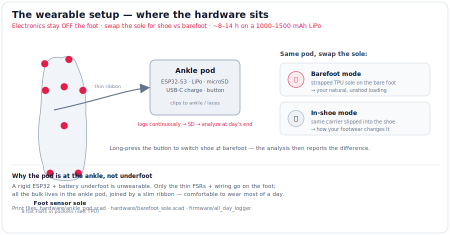

What you **order** vs what the printer **makes** (with lifespans / a day of use):

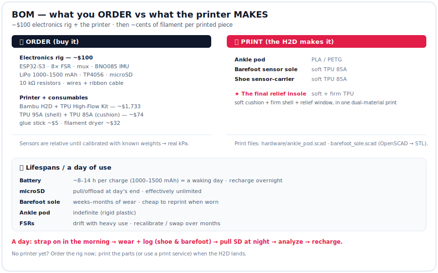

**A day of use** — when you wear it, how long each piece lasts, battery per day:

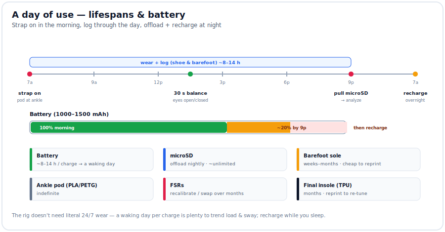

**Two software modules** from the same sensors — foot pressure *and* balance:


The **balance module** in depth — posturography, Romberg, fall-risk → device class:

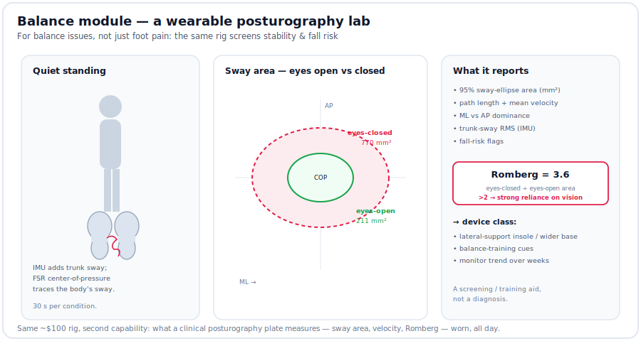

**Balance across stance positions** — mCTSIB sensory reliance, single-leg asymmetry, tandem, limits-of-stability ([balance_positions.md](docs/balance_positions.md)):

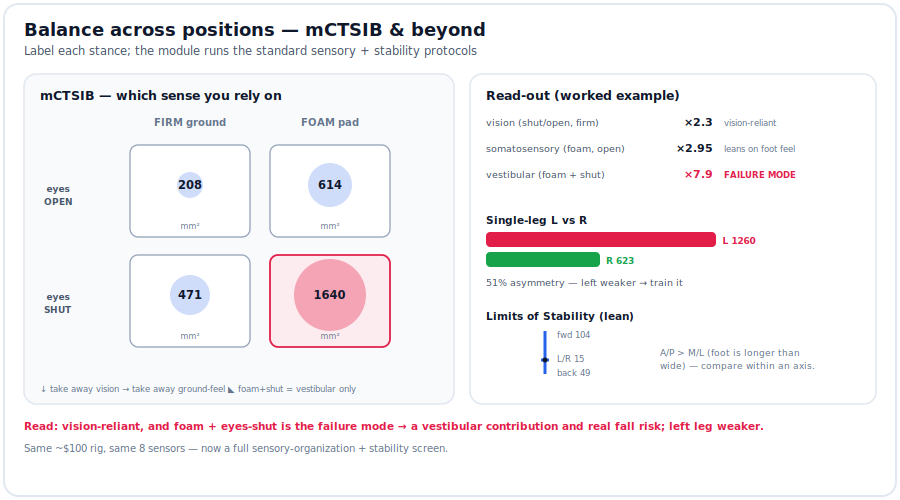

**Balance-assist ecosystem** — syncs with **Apple Watch**, **Parkinson's cueing glasses** (freezing-of-gait → floor-lines/metronome), and **smart walkers** ([balance_assist.md](docs/balance_assist.md), [integrations/](integrations/README.md)):

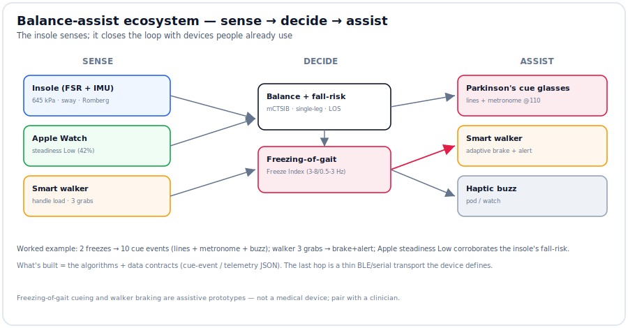

**Beam / athlete balance** (specialized) — ML control + a judge-style **landing "stick"** score for gymnasts ([beam_balance.md](docs/beam_balance.md)):

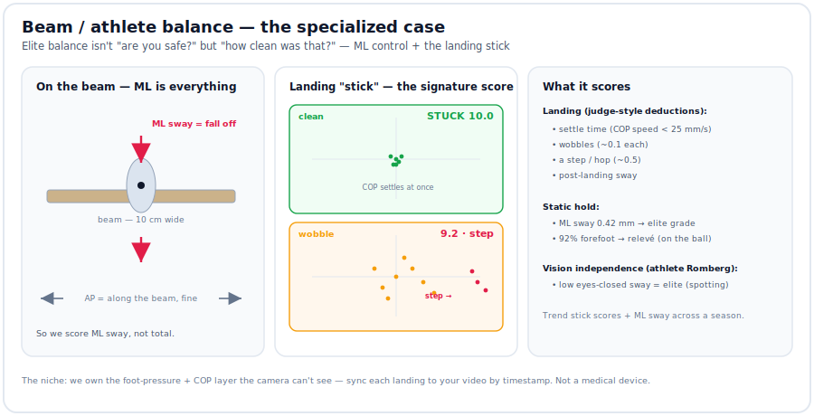

**Landing lab** — the *same* landing scored by discipline: gymnastics **stick**, figure-skating **edge check-out**, dance **soft roll** ([landing_lab.md](docs/landing_lab.md)):

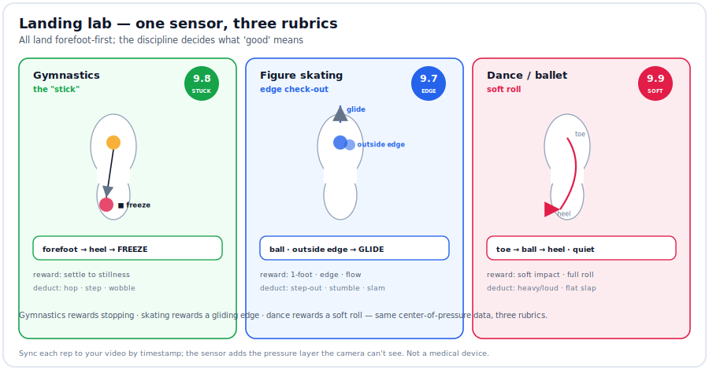

**Zone load vs the field** — per-metatarsal over/under-use vs **cited** sports-medicine norms, mapped to injury ([zone_load.md](docs/zone_load.md), [refs/](refs/README.md)):

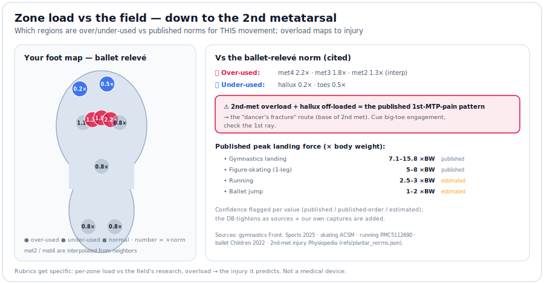

> 🧭 **Also:** a new [**balance module**](docs/balance.md) (posturography — sway, Romberg quotient, fall-risk flags) turns the same rig into a stability screen for balance issues, not just foot pain. And [**prototype_status.md**](docs/prototype_status.md) is the "is it ready to build/pitch?" summary + the ordered-vs-printed BOM. Print models + STL export: [hardware/](hardware/README.md).

### ▶️ See it work — no hardware needed
The [**`sample/`**](sample/README.md) folder runs the **entire pipeline on a synthetic day of data**: calibrate → real **kPa** → findings → a **printable insole the software designs itself** → a balance/fall-risk screen. Reproduces in ~5 seconds; every output is committed so you can read it now.

<p align="center">
  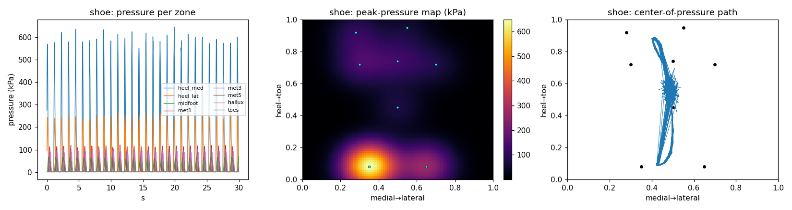
</p>

**Result:** hot spot at **heel_med (645 kPa, 40% of load)**, medial pronation, heel-dominant; the shoe *adds* +13 pts vs barefoot → the generator emits an **aggressive medial-heel relief insole** ([`hardware/relief_insole.stl`](hardware/relief_insole.stl)). Balance: **Romberg 3.6** (vision-reliant). Full write-up → [sample/README.md](sample/README.md).

---

## 🖨️ Path 1 — the printer-first workflow (start here)
1. **Scan** your existing orthotic → STL (iPhone photogrammetry — Scaniverse/Polycam). See [docs/insole_print_spec.md](docs/insole_print_spec.md) §1.
2. **Mark the sore spot** on the scan (dead-center / inner / back heel — you already know where).
3. **Design** the insole: soft-lattice heel cushion + firm support shell + a **relief pocket** at that spot. [docs/insole_print_spec.md](docs/insole_print_spec.md) §2–5.
4. **Print** it in TPU on the H2D — soft cushion nozzle + firm shell nozzle in one part.
5. **Wear it.** Too much/little somewhere? Nudge the window size/density and **reprint.** Iterate by feel.

That's the whole loop — **no measurement hardware.**

**What to buy:** just the **printer + filament**. See [docs/parts_list.md](docs/parts_list.md) → *"WITH a printer."*
| Part | Why |
|---|---|
| **Bambu Lab H2D** | Prints soft cushion + firm shell in one insole |
| **H2D TPU High-Flow Kit** | Nozzles tuned for flexible TPU |
| **Soft / foaming TPU** (VarioShore) | The squishy heel cushion (won't bottom out) |
| **Firm TPU 95A** | The support shell |
| **PLA / PETG** | (optional) for a mold or enclosure |

---

## What's in the repo
| File | What it is |
|---|---|
| ⭐ [docs/insole_print_spec.md](docs/insole_print_spec.md) | **The insole design + print settings** (relief window, density zones) — Path 1's core |
| ▶️ [sample/](sample/README.md) | **Worked example** — full pipeline on synthetic data (kPa → insole → balance) |
| 🖨️ [hardware/build_insole.py](hardware/build_insole.py) | Reads `insole_spec.json` → emits a **print-ready insole**, **fitted to your foot** by measurements or a scan ([how](docs/fit_to_your_foot.md)) |
| [docs/parts_list.md](docs/parts_list.md) | Every part with buy links (printer path + optional rig) |
| [docs/what-each-part-is-for.md](docs/what-each-part-is-for.md) | Plain-English part purposes |
| [docs/quickstart.md](docs/quickstart.md) | Both paths, step by step |
| `firmware/` + `analysis/` | The **optional** sensor rig (Path 2) |
| [docs/opencap_setup.md](docs/opencap_setup.md) | **Optional** markerless motion capture (Path 2) |

---
---

# 🔬 Path 2 — Optional: data-driven sensor rig (advanced)

**Skip all of this unless** you want to *measure* pressure objectively and place the relief window from data instead of feel. It adds parts, wiring, and code — but gives you a real hot-spot map and before/after proof.

> 🏗️ **Ready to actually build it?** The all-day, **barefoot-and-shoe** tracking build is spec'd end-to-end in **[docs/path2_tracking_build.md](docs/path2_tracking_build.md)** — with print-ready [`hardware/ankle_pod.scad`](hardware/ankle_pod.scad) + [`hardware/barefoot_sole.scad`](hardware/barefoot_sole.scad) and the all-day firmware [`firmware/all_day_logger/`](firmware/all_day_logger/all_day_logger.ino). Electronics live in an **ankle pod**, not underfoot; ~8–14 h on a 1000–1500 mAh LiPo.

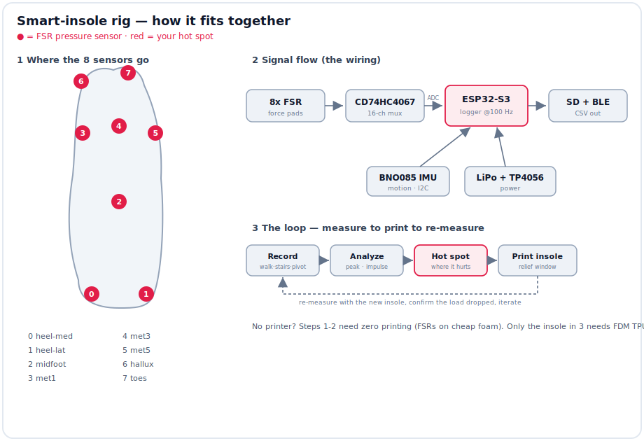

```
  iPhone LiDAR/photo ─┐
   (foot/orthotic)    ├─► foot GEOMETRY (STL)     ← also used by Path 1
                      │
  OpenCap (2 iPhones)─┼─► MOTION across movements (joint angles, gait)
                      │
  DIY smart insole ───┴─► dynamic PRESSURE (peak/impulse per zone, COP)
                                  │
                                  ▼
                    Python analysis → HOT SPOT + gait findings
                                  │
                                  ▼
                    H2D prints insole (soft lattice + firm shell + relief window)
                                  │
                                  ▼
                    Re-measure → verify load dropped → iterate
```

### Sensor-rig BOM (~$70–120) — *optional*
> 🧐 Not sure what a part does? [docs/what-each-part-is-for.md](docs/what-each-part-is-for.md) explains each in plain English.

| Part | Qty | ~$ | Notes |
|---|---|---|---|
| ESP32-S3 DevKitC-1 | 1 | 8–15 | The brain (BLE + ADC/SPI/I2C) |
| **FSR402** force sensors | 8 | ~6 ea | Pressure sensors under the foot |
| **CD74HC4067** 16-ch mux | 1 | 2 | 8 FSRs → 1 ADC pin |
| **BNO085** IMU | 1 | 20 | Motion (pronation, strike timing) |
| microSD SPI module + card | 1 | 8 | Onboard logging |
| 10 kΩ resistors | 8 | ~2 | FSR voltage dividers |
| LiPo 500 mAh + **TP4056** charger | 1 | 10 | Wearable power |
| EVA sheet, wires, perfboard, tape | — | 10 | Mount the FSRs |

> DIY FSR insoles validate to **r ≈ 0.87** vs professional systems — plenty for *relative* hot-spot mapping.

### Wiring (ESP32-S3 pin map — matches the firmware)
| Signal | ESP32-S3 GPIO |
|---|---|
| Mux SIG (analog out) | GPIO1 (ADC1_CH0) |
| Mux S0 / S1 / S2 / S3 | GPIO2 / 3 / 4 / 5 |
| Mux EN | GND |
| IMU SDA / SCL (I2C) | GPIO8 / GPIO9 |
| SD CS / MOSI / SCK / MISO (SPI) | GPIO10 / 11 / 12 / 13 |
| Button (start/stop + cycle activity) | GPIO14 → GND (internal pull-up) |
| Status LED | GPIO15 |

**Each FSR** is a voltage divider: `3V3 ── FSR ──●── 10kΩ ── GND`, node `●` → a mux channel. Higher force → higher voltage.

### FSR → foot-zone map (default 8-sensor layout)
```
        toes
   hallux   met5
 met1   met3
      midfoot
 heel_med  heel_lat
```
Channel order in firmware/analysis: `0 heel_med, 1 heel_lat, 2 midfoot, 3 met1, 4 met3, 5 met5, 6 hallux, 7 toes`.

### Data format (CSV, ~100 Hz)
```
t_ms,activity,fsr0,fsr1,fsr2,fsr3,fsr4,fsr5,fsr6,fsr7,qw,qx,qy,qz,ax,ay,az
```
Then run `analysis/analyze_pressure.py` → peak/impulse per zone + hot-spot → feed the relief-window location back into Path 1.

---

## Safety / expectations
- This is a design aid, **not a medical device.** You already have custom orthotics — treat this as tuning on top of them.
- Path 2 FSRs give **relative, repeatable** pressure, not lab-grade kPa (calibration hook in the analysis script).
