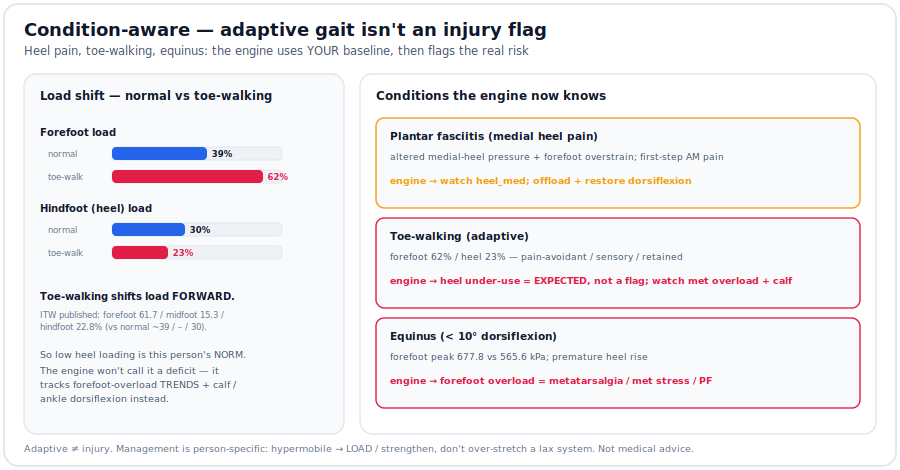

# Condition-aware analysis — adaptive gait isn't an injury flag

Most tools assume a "normal" foot. Real people have **adaptive or altered baselines** —
heel pain, toe-walking, limited ankle motion. If you compare them to a textbook norm you
get false flags ("your heel is under-used!") that miss the point. So the engine can take
**your baseline as the reference**, then flag only the *real* risk.



## The conditions (in `refs/plantar_norms.json`, cited)
| Condition | What the data shows | The engine's response |
|---|---|---|
| **Plantar fasciitis** (medial heel pain) | altered medial-heel pressure vector + forefoot/met overstrain; first-step morning pain ([PF gait](https://pmc.ncbi.nlm.nih.gov/articles/PMC5773441/)) | watch `heel_med`; offload the heel + restore ankle dorsiflexion |
| **Toe-walking** (idiopathic / adaptive) | **forefoot 61.7% / midfoot 15.3% / hindfoot 22.8%** vs normal ~39% / – / 30% ([ITW](https://pubmed.ncbi.nlm.nih.gov/31946390/)) | **low heel loading = the adaptive baseline, NOT a deficit**; track forefoot-overload trends + calf tightness |
| **Equinus** (< 10° dorsiflexion) | forefoot peak **677.8 kPa** vs **565.6** without equinus; premature heel rise ([ankle flexibility](https://www.ncbi.nlm.nih.gov/pmc/articles/PMC9338503/)) | forefoot overload → metatarsalgia / met stress / plantar plate / PF |

Autism-associated gait shows a forefoot-loading tendency and more L/R asymmetry; an
8-week program reduced medial-heel peak pressure and loading rate ([ASD](https://www.ncbi.nlm.nih.gov/pmc/articles/PMC9993582/)).

## Use it
```bash
# your baseline IS the profile (no false heel-deficit flag):
python zone_load.py --demo --profile toe_walking

# or a movement profile + your condition context:
python zone_load.py session.csv --profile running_forefoot --condition equinus --calibration cal.json
```
With `--condition` set to an **adaptive** pattern, heel under-use is annotated
*"expected — adaptive baseline, not a flag,"* and the report surfaces the condition's
published baseline, its **real** risks (forefoot overload, calf/Achilles), and a
person-specific management note.

## These loop together
Toe-walking, heel-pain avoidance, and equinus are one story: chronic plantarflexion
tightens the calf (equinus), which forces forefoot overload, which is what a toe-walker
already does — and avoiding a painful heel reinforces all of it. The engine watches the
**forefoot-overload trend + ankle dorsiflexion**, not the (expected) low heel.

> **Management is person-specific.** The textbook equinus fix is "stretch the calf" — but
> a **hypermobile** person usually needs **loading / strengthening**, not more stretch on
> an already-lax system. Reversing toe-walking isn't always the goal; if it's kept,
> protect the forefoot (met pad / cushion) and preserve ankle motion.

Not medical advice — a screening/training aid; work with a clinician who knows your history.
