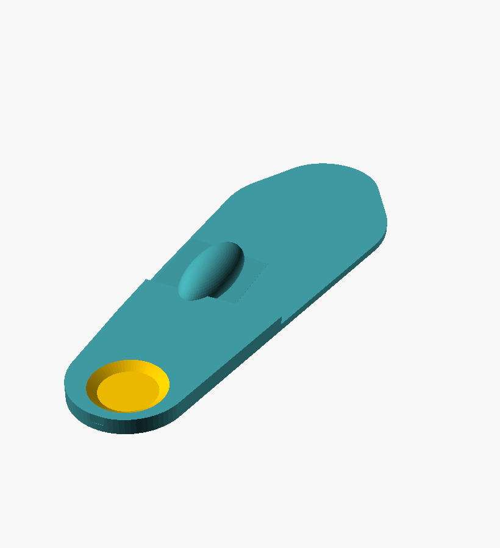
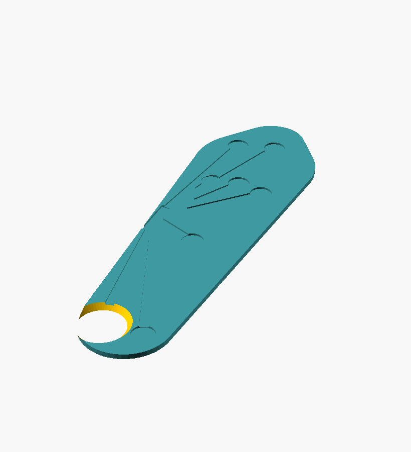

# Fitting the insole to *your* foot

Two things make an insole yours: **where it offloads** (from your measured pressure)
and **the shape it wraps** (your foot's outline + arch). The pressure side is already
personal — `interpret.py` places the relief window, posting, and cushion from *your*
data. This page is about the **geometry**.

`hardware/build_insole.py` offers three fit levels — same directives, better fit:

| Level | Command flag | Fit | Needs |
|---|---|---|---|
| 1 · Generic | *(default)* | a nominal footbed | nothing |
| 2 · Measurements | `--length --forefoot-width --heel-width --arch-height` | scaled to your foot's size + arch | a ruler |
| 3 · Scan | `--scan your_orthotic.stl` | your **real** outline + arch contour | a phone scan |

All three carve the relief window at the **same data-driven hot spot** — they differ
only in the body they carve it into.

---

## Level 2 — fit by measurements (a ruler, 2 minutes)
Measure your foot (stand on paper, trace, measure; barefoot, weight-bearing):

- **length** — heel to longest toe (mm)
- **forefoot width** — widest part, across the ball
- **heel width** — across the heel
- **arch height** — gap under the arch at its highest (0 = flat; ~10–18 mm typical)

```bash
python build_insole.py --spec ../sample/results/insole_spec.json \
  --length 262 --forefoot-width 99 --heel-width 64 --arch-height 14 --side right
```



*The footbed scales to your dimensions and grows a medial arch dome; the relief pocket,
medial post, and heel cushion are placed from your pressure data.* Use `--side left` for
the left foot.

---

## Level 3 — fit to a scan of your orthotic (best)
You already have **custom orthotics** — they already fit your foot. So scan one and let
the software add the measured relief into that exact shape:

1. **Scan** your orthotic (top surface up) with a phone: **Polycam** or **Scaniverse**
   (LiDAR or photogrammetry) → export **STL**. Keep it roughly flat, Z up.
2. **(If needed) clean the mesh** so it's watertight — Meshmixer *Analysis ▸ Inspector ▸
   Auto Repair* / *Edit ▸ Make Solid*, or Blender's 3D-Print toolbox. Photogrammetry
   meshes are often non-manifold, which breaks the boolean.
3. **Carve the relief:**
```bash
python build_insole.py --spec ../sample/results/insole_spec.json \
  --scan my_orthotic.stl --name fitted --side right
```



*The script reads your scan's bounding box, maps the hot-spot zone onto it, finds the
**local top surface** there, and carves the relief pocket to depth into your real
contour.* (Above: a demo carving into the sensor-sole mesh — the pocket is the hollow at
the heel.) The scan supplies the outline + arch; posting/cushioning you already have in
the orthotic, so scan-mode focuses on the relief.

> **Alignment:** the longer horizontal axis is taken as foot length, heel at the low end.
> If heel/toe come out swapped, add `--side left` (mirrors medial/lateral) or re-export the
> scan the other way. Verify the pocket lands under your sore spot before printing.

---

## Which should I use?
- **First print / no scan?** Level 2 — a ruler gets you 90% of the fit.
- **Have an orthotic you like?** Level 3 — copy its fit exactly, add the relief, print in
  comfortable TPU.
- Either way: **print → wear → nudge the relief/arch → reprint.** The fit converges fast.

Not a medical device — a design aid. Pair with your podiatrist, especially since you're
building on top of prescribed orthotics.
