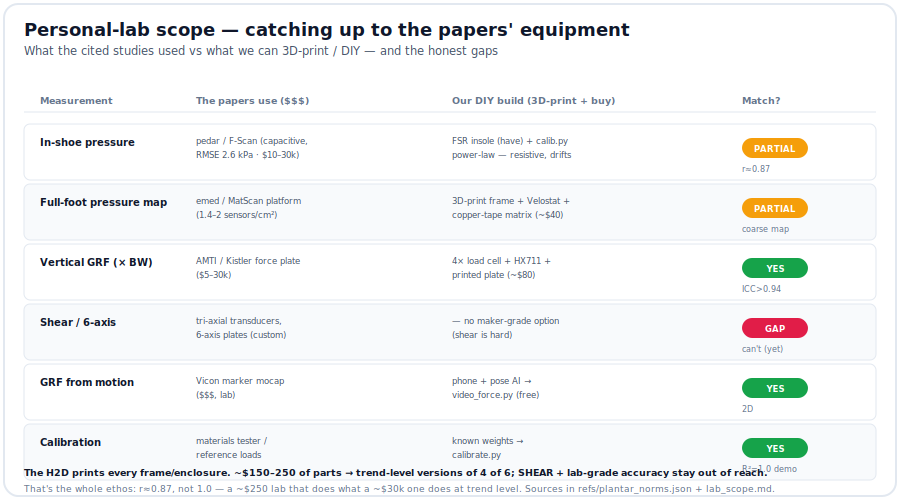

# Personal-lab scope — catching up to the papers' equipment

The studies we cite ran on **$10k–30k+** kit. This is the honest map of what that kit is,
what we can **3D-print / DIY** to approximate it, and where the gaps genuinely stay.

## What the papers used
| Class | Instruments | Spec / accuracy | ~Cost |
|---|---|---|---|
| **In-shoe pressure** | Novel **pedar** (capacitive), Tekscan **F-Scan** (resistive), Moticon, Loadsol | pedar RMSE **2.6 kPa** (best); F-Scan/resistive RMSE ~31 kPa (drift) | $10–30k |
| **Platform pressure** | Novel **emed** (2 sensors/cm²), Tekscan **MatScan** (1.4/cm²), RSscan **Footscan** | MatScan within **1.9%** of an AMTI plate | $10–40k |
| **Force plate (GRF)** | **AMTI**, **Kistler**, **Bertec** | 6-axis force + moments + CoP | $5–30k |
| **Shear stress** | tri-axial force transducers | 3-axis stress (cutting shear 312–463 kPa) | custom/research |
| **Motion → GRF** | **Vicon** marker mocap; or 2D-pose→GRF | validated | $$$ (mocap) / free (pose) |

Key finding: **capacitive (pedar) beats resistive** (Tekscan/FSR) — resistive sensors have
**hysteresis, creep, and drift** (sensitivity shifts over the first minute + long-term).
That's the accuracy tax our FSR rig pays, and why calibration matters ([FSR feasibility](https://www.researchgate.net/publication/335528169), [3 in-shoe systems](https://www.ncbi.nlm.nih.gov/pmc/articles/PMC4101558/)).

## What WE can build (3D-print + buy)
1. **FSR sensor insole** — *have it.* Resistive, 8 zones, `calib.py` power-law → kPa. Coarse
   + drifts, but **r≈0.87 vs pro** — fine for relative/trend mapping.
2. **Velostat pressure MAT (platform)** — a copper-tape **row×column matrix** sandwiching
   [Velostat](https://www.adafruit.com/product/1361) (~$4/sheet), read by an ESP32/Arduino via the mux. A
   maker build hit **~7000 cells, clearly resolving heel/arch/forefoot** ([Hackaday](https://hackaday.com/2017/10/29/hi-res-body-sized-pressure-sensor-mat/)). **3D-print the frame.** ~$40 in parts.
3. **Load-cell force plate (vertical GRF)** — **4× load cells + HX711** on a rigid **3D-printed/
   plywood** top → **vertical GRF in body-weights** (the landing numbers). Instrumented
   load-cell systems hit **ICC > 0.94** vs a force plate ([Loadsol vGRF](https://www.ncbi.nlm.nih.gov/pmc/articles/PMC12747385/)). ~$80.
4. **Video → force** — phone + pose AI → [`video_force.py`](../integrations/video_force.py). *Free.*
5. **Calibration** — known weights → [`calibrate.py`](../analysis/calibrate.py) (demo R²=1.0).

## Parts: print vs buy
| 3D-print (H2D) | Buy |
|---|---|
| ankle pod, sensor soles, insoles | ESP32-S3, 8× FSR, mux, IMU, microSD, LiPo (**have in carts**) |
| **pressure-mat frame** + electrode jig | **Velostat sheet** (~$4) + copper tape + a bigger mux/ADC (16–32ch) |
| **force-plate top + 4 load-cell mounts/feet** | **4× load cells** (50 kg bar type) + **HX711** amp (~$15–25 total) |
| calibration weight tray | (use known weights / a bathroom scale as a check) |

Extra parts for the two new builds: **~$150–250** on top of the insole rig.

## The honest gaps (what we can't cheaply match)
- **Shear / 6-axis** — the cutting shear numbers need tri-axial transducers; **no maker-grade
  option.** Real gap.
- **Capacitive-grade accuracy + no drift** — pedar's 2.6 kPa RMSE; our resistive rig drifts →
  recalibrate, and read trends not absolutes.
- **Spatial density** — emed's 2 sensors/cm² vs our coarse zones (the Velostat mat narrows this
  but at lower accuracy).
- **Marker mocap** — Vicon 3D; we substitute 2D pose→GRF.

## Roadmap (priority for a one-person lab)
1. **Force plate first** (load cells + HX711 + printed top) — unlocks the **GRF/×BW** numbers
   (landings, jump, gym) that our insole can't, at ICC>0.94. Cheapest big win.
2. **Velostat mat** — a real full-foot pressure map (heel/arch/forefoot) to complement the
   8-zone insole; great for the standing/seated/bounce work.
3. Keep tightening **FSR calibration** (per-sensor, re-run when it drifts).
4. **Shear** stays parked — accept the gap, or revisit if a maker-grade 3-axis sensor appears.

Ethos: **r≈0.87, not 1.0.** A ~$250 lab that does what a ~$30k one does *at trend level* — which,
for finding *your* hot spots and dosing *your* load over time, is the measurement that matters.
Not a medical device.
