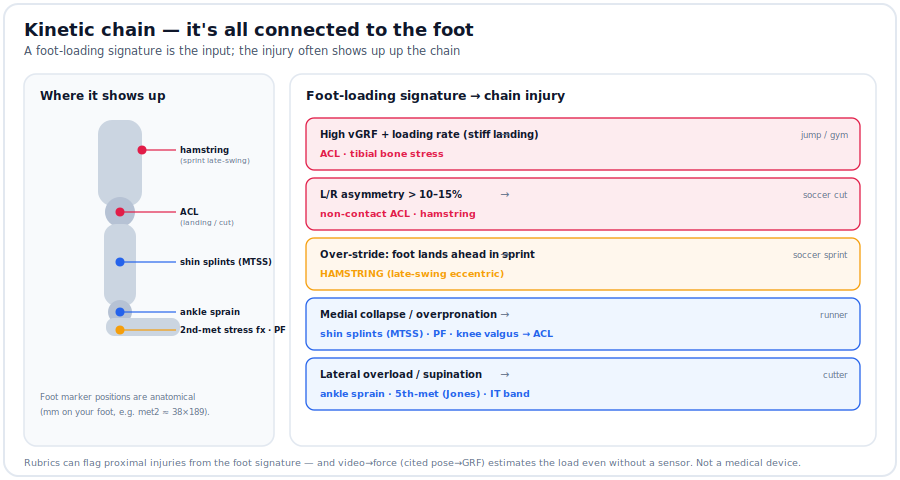

# Video → force (and the kinetic chain)

Two ideas the sensor alone can't reach: **estimate the force even without an insole**
(from video), and **connect foot loading to injuries up the chain** (hamstring, ACL,
shin — "it's all connected to the foot").



## Video → force — [`integrations/video_force.py`](../integrations/video_force.py)
2D-pose → vertical GRF is validated ([PMC11057390](https://www.ncbi.nlm.nih.gov/pmc/articles/PMC11057390/)).
Feed the athlete's **center-of-mass vertical trajectory** (from any pose estimator —
MediaPipe / OpenPose / BlazePose) and it applies the single-body model
`F(t) = m·(a_com + g)`, then **checks the peak against the cited published range** for
that sport and flags **L/R asymmetry** (an ACL precursor > 10–15%).

```bash
python video_force.py --demo                                   # CoM demo
python video_force.py --pose com_y.json --mass-kg 60 --profile jump_landing
python video_force.py --flight-time 0.42 --contact-time 0.12 --mass-kg 60 --profile jump_landing
python video_force.py --peak-left-bw 4.6 --peak-right-bw 3.7    # asymmetry only
```
> Demo: CoM landing → **6.8× BW (ABOVE the published 3–6× jump-landing range → injury-relevant)**;
> and left 4.6× vs right 3.7× → **20% asymmetry → ACL precursor**.

**Estimate, not a measurement.** When you *do* have the insole, it measures the pressure
directly; video fills in when you don't — and the DB gives the published range to check
the estimate against ("estimation fine, exact better").

## Kinetic-chain injuries — [`refs/plantar_norms.json`](../refs/README.md) `chain_rules`
A foot-loading **signature** maps to injuries **up the chain**:

| Signature | Chain injury | Seen in |
|---|---|---|
| High vGRF + loading rate (stiff landing) | **ACL** · tibial bone stress | jump / gym |
| L/R asymmetry > 10–15% | non-contact **ACL** · hamstring | soccer cut |
| Over-stride (foot lands ahead) in sprint | **HAMSTRING** (late-swing eccentric) | soccer sprint |
| Medial collapse / overpronation | shin splints (MTSS) · PF · knee valgus → ACL | runner |
| Lateral overload / supination | ankle sprain · 5th-met (Jones) · IT band | cutter |

`analysis/zone_load.py` prints the chain injury for the movement's profile, and the
over-used zones now report their **anatomical position in mm on your foot** (scaled by
`--foot-length-mm`) — e.g. *met2 ≈ (x 38, y 189) mm, the 2nd-met head*.

Sources: hamstring [PMC6188997](https://pmc.ncbi.nlm.nih.gov/articles/PMC6188997/) /
[soccer HSI review](https://www.frontiersin.org/journals/public-health/articles/10.3389/fpubh.2026.1846524/full);
ACL [PMC4920967](https://pmc.ncbi.nlm.nih.gov/articles/PMC4920967/) /
[PMC8359711](https://pmc.ncbi.nlm.nih.gov/articles/PMC8359711/). Not a medical device.
