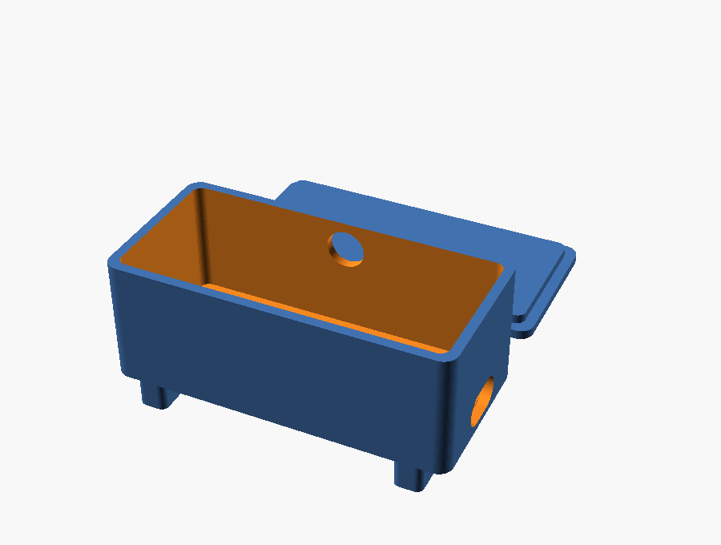
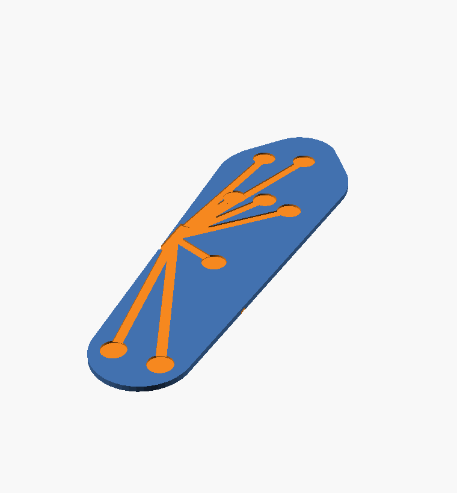

# hardware — the printable 3D models

Parametric **OpenSCAD** source **plus pre-rendered STLs** — ready to slice today.

| Source | STL (ready to slice) | Preview | Print in | What |
|---|---|---|---|---|
| [`ankle_pod.scad`](ankle_pod.scad) | [`ankle_pod.stl`](ankle_pod.stl) |  | PLA / PETG | Enclosure for ESP32-S3 + LiPo + microSD; USB-C + button + ribbon cutouts + strap slots |
| [`barefoot_sole.scad`](barefoot_sole.scad) | [`barefoot_sole.stl`](barefoot_sole.stl) |  | **soft TPU 85A** | Thin footbed with 8 FSR pockets + wire channels + strap slots |

## Print now (STLs are committed)
The `.stl` files above are already rendered at the default parameters — **drop them straight into Bambu Studio and slice.** No OpenSCAD needed unless you want to customize.

## Customize + re-export (2 minutes)
1. Install **[OpenSCAD](https://openscad.org/downloads.html)** (free, Win/Mac/Linux).
2. Open a `.scad` file.
3. **Edit the parameters at the top** to your parts (measure your board / your foot).
4. Press **F6** (full render) → **File ▸ Export ▸ Export as STL**.
   *(CLI equivalent: `openscad -o ankle_pod.stl ankle_pod.scad`)*
5. Slice in **Bambu Studio** and print.

## Print settings (starting points)
| Part | Material | Notes |
|---|---|---|
| **Ankle pod** | PLA or PETG | 0.4 mm, 3 walls, 20% infill; PETG if it'll get warm/sweaty |
| **Barefoot sole** | **soft TPU 85A** | 0.4/0.6 mm (TPU High-Flow hotend), ~15% gyroid, 3 walls; glue stick helps release |
| **Final insole** | soft + firm TPU | see [`../docs/insole_print_spec.md`](../docs/insole_print_spec.md) — dual-material on the H2D |

## True-fit tip
For a shoe insole that matches your foot, don't use the generic `barefoot_sole` outline — **boolean the FSR-pocket pattern into your *scanned* orthotic/insole** (scan per [`../docs/insole_print_spec.md`](../docs/insole_print_spec.md)).
