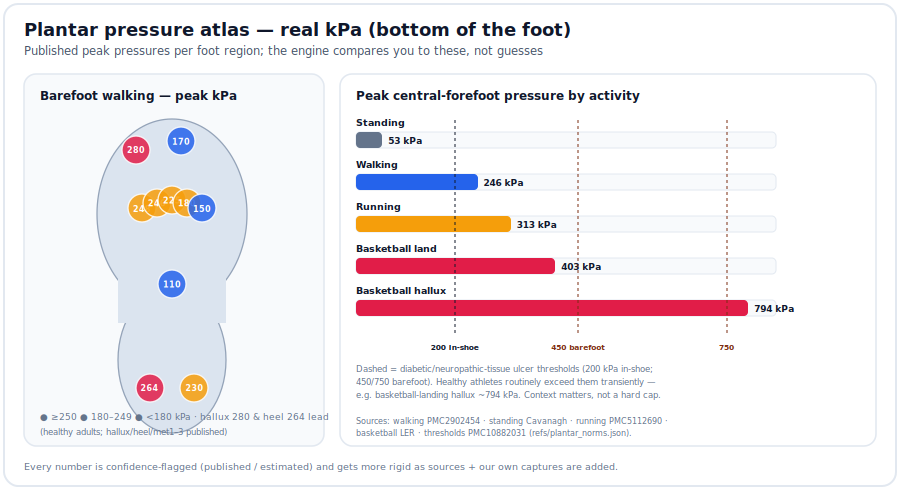
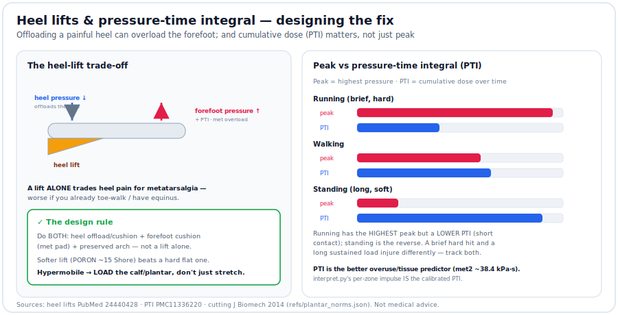
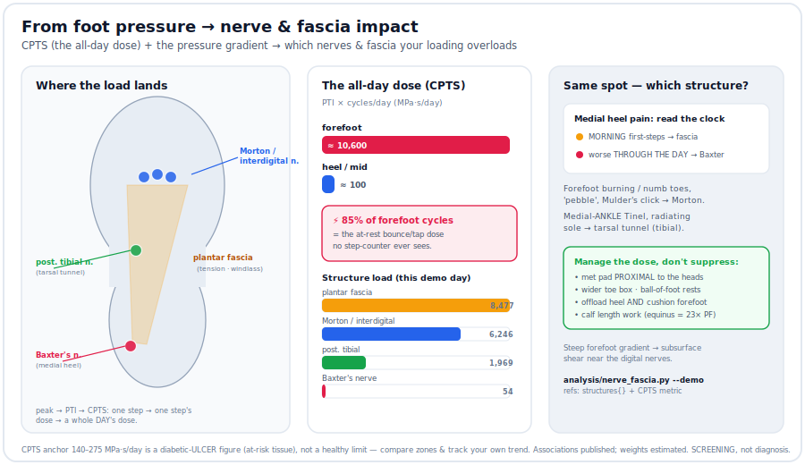

# refs — cited plantar-load reference database

[`plantar_norms.json`](plantar_norms.json) is the **norms** the analysis compares an
athlete against: per foot **zone** (down to the 2nd metatarsal), per **sport/movement**,
the expected **load distribution** and **peak force** — from published sports-medicine
research where possible.

## Why a database (not just estimates)
A rubric is only as good as its reference. "Your met2 is at 21% of load" means nothing
until you know the field's norm is 16% — *then* it's a 1.3× overload and an injury flag.
So we keep the norms in one cited, versioned file that gets **more rigid as sources are
added**. `analysis/zone_load.py` reads it.

## Honesty: every value carries a confidence flag
- **`published`** — the value/range is stated in the cited paper (e.g. gymnastics
  landing **7.1–15.8× BW**).
- **`published_order`** — the *ranking* of zones is from a paper (e.g. running: central
  met heads > 1st met > heel > hallux > lateral); magnitudes are filled to match.
- **`estimated`** — biomechanically reasonable, **no direct source yet** (a TODO to
  replace with data).

"Estimation fine, exact better": the peak-force ranges are mostly `published`; several
per-zone magnitude splits are `published_order` or `estimated` and clearly marked.
**Contributions = add a paper + tighten a distribution + flip a flag to `published`.**

## What's in it (v0.3)

**Real per-zone peak pressures (kPa)** now populate the bottom-of-foot profiles:

| Activity | Published peak pressures (kPa) | Source |
|---|---|---|
| Barefoot **walking** | hallux **280** · heel **264** · met1 **248** · met2 **246** · met3 **225** | [PMC2902454](https://www.ncbi.nlm.nih.gov/pmc/articles/PMC2902454/) |
| Quiet **standing** | heel **139** vs forefoot **53** (heel 60% / midfoot 8% / forefoot 28% of load) | [Cavanagh](https://pubmed.ncbi.nlm.nih.gov/3583160/) |
| **Running** | forefoot **313** · total **364** · rearfoot mid/hind ~**190** | [PMC5112690](https://pmc.ncbi.nlm.nih.gov/articles/PMC5112690/) |
| **Basketball landing** | hallux **794** · forefoot **403** (central-forefoot 50% / hallux 25%) | [LER](https://lermagazine.com/special-section/defensive-game-planning/soccer-basketball-players-demonstrate-differences-in-plantar-pressure-patterns) |

Plus **`clinical_thresholds`** — 200 kPa in-shoe / 450 & 750 kPa barefoot ulcer-risk
([PMC10882031](https://pmc.ncbi.nlm.nih.gov/articles/PMC10882031/)) — with the explicit
note that these are **neuropathic-tissue** limits, **not** athletic caps (healthy
athletes routinely exceed them transiently).

Profiles (12): **`standing`**, **`walking`** (baselines), running (rear/forefoot),
gymnastics / figure-skating / **basketball** / jump landings, ballet (relevé/pointe),
soccer (sprint/cut). Each: `dist_pct`, `peak_pressure_kPa` (where sourced),
`peak_force_BW`, `watch_zones`, `injury` + `chain_injury`, sources. Plus:
- **`zone_anatomy`** — each zone's **anatomical position** (`pos_mm` on a 255 mm foot).
- **`chain_rules`** — foot **signatures → kinetic-chain injuries** (hamstring, ACL, shin).
- **Condition profiles** (v0.4) — `plantar_fasciitis`, `toe_walking`, `equinus`: a person's
  **adaptive/altered baseline**, so `zone_load.py --condition` doesn't false-flag it (a
  toe-walker's low heel is the norm) and instead surfaces the condition's real risks. See
  [../docs/conditions.md](../docs/conditions.md). Cited: ITW forefoot 61.7% ([PubMed 31946390](https://pubmed.ncbi.nlm.nih.gov/31946390/)),
  equinus forefoot 677.8 kPa ([PMC9338503](https://www.ncbi.nlm.nih.gov/pmc/articles/PMC9338503/)).

**v0.5** adds a **`metrics`** section (peak vs **pressure-time integral** — the cumulative-dose
injury predictor; met2 PTI ~38.4 kPa·s, [PMC11336220](https://www.ncbi.nlm.nih.gov/pmc/articles/PMC11336220/)),
a **`footwear_effects`** section (heel lifts offload the heel but raise forefoot pressure + PTI
→ design rule: offload heel **and** cushion forefoot, [PubMed 24440428](https://pubmed.ncbi.nlm.nih.gov/24440428/)),
and cutting flipped to published (peak @ met2, 1st-met shear 312–463 kPa, [J Biomech 2014](https://www.sciencedirect.com/science/article/abs/pii/S0021929014005491)).

**v0.6** adds a **`structures`** block — the **nerves & fascia** that specific loading patterns
overload (plantar fascia, Baxter's nerve, Morton's/interdigital nerve, posterior tibial/tarsal
tunnel), each with its zones, loading mode, differentiating clue, and citation — plus two metrics:
**CPTS** (cumulative plantar tissue stress = PTI × cycles/day, the all-day dose, [PMID 29477099](https://pubmed.ncbi.nlm.nih.gov/29477099/))
and the **pressure gradient** (subsurface shear near nerves, [PMC2387244](https://pmc.ncbi.nlm.nih.gov/articles/PMC2387244/)).
Consumed by [`analysis/nerve_fascia.py`](../analysis/nerve_fascia.py) → [nerve_fascia.md](../docs/nerve_fascia.md).
Associations are published; the zone-weights are `estimated`. Screening, not diagnosis.

Key sourced facts:
| | Finding | Source |
|---|---|---|
| Gymnastics | landing **7.1–15.8× BW** | [Front. Sports Act. Living 2025](https://pmc.ncbi.nlm.nih.gov/articles/PMC12179790/) |
| Figure skating | single-leg landing **~5× BW** (to ~8×) | [ACSM](https://acsm.org/the-science-of-figure-skating-jumps/) |
| Running | central met heads bear most; forefoot **281–313 kPa** | [PMC5112690](https://pmc.ncbi.nlm.nih.gov/articles/PMC5112690/) |
| Ballet | 1st-MTP pain → **less hallux, more met-head** load | [Children 2022](https://pmc.ncbi.nlm.nih.gov/articles/PMC9406650/) |
| Injury | **2nd met** = #1 stress-fracture site ("dancer's fracture") | [Physiopedia](https://www.physio-pedia.com/Metatarsal_Stress_Fractures_in_the_Athletic_Population) |

## Roadmap (more rigid)
- Replace `estimated` distributions with per-zone baropodometry from papers/our own captures.
- Add profiles: sprinting, jump-landing (volleyball/basketball, ACL), soccer cut, martial-arts kick, walking-gait clinical norms.
- **Video → force** estimation as a connector: 2D-pose → GRF is now feasible
  ([pose-estimation GRF, PMC11057390](https://www.ncbi.nlm.nih.gov/pmc/articles/PMC11057390/));
  it *estimates* the peak force, then this DB gives the *published* range to check it against.
- Our own captures (calibrated insole) feed back in — the DB tightens as we scale.

Not medical advice — a training/screening reference. Values summarize published research;
verify against primary sources for clinical use.
