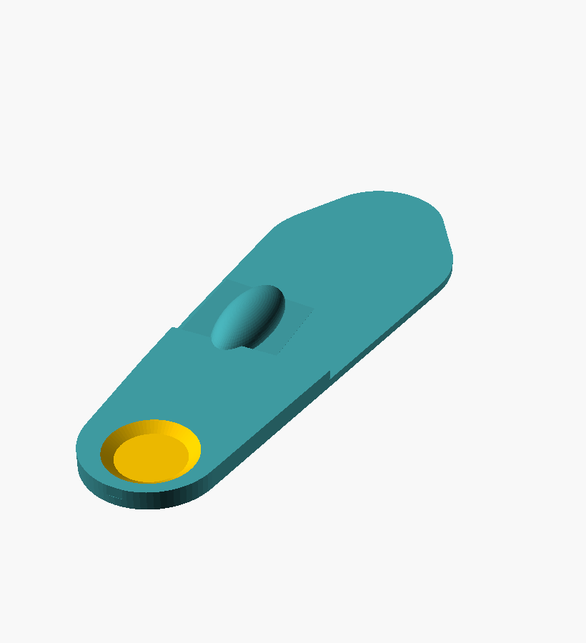

# Worked example — the whole pipeline, no hardware

This folder is a **self-contained demo**: a *synthetic* day of data run through the
entire pipeline, so you can see exactly what the system produces before you build
anything. Everything here is regenerated by the scripts (all values below are the
committed run).

> ⚠️ **Synthetic data**, generated by [`../analysis/make_sample_data.py`](../analysis/make_sample_data.py)
> from a physically-consistent FSR model — **not** a real measurement. It's seeded to
> tell a realistic story (a medial-heel hot spot + a vision-reliant balance pattern).

## Reproduce it (≈5 s)
```bash
cd analysis
python make_sample_data.py --out ../sample                                   # 1. fake a day of data
python calibrate.py ../sample/cal_points.csv --out ../sample/calibration.json --r-fixed 1000   # 2. fit ADC→kPa
python interpret.py "../sample/sample_day_*.csv" --calibration ../sample/calibration.json --out ../sample/results   # 3. pressure → directives
python balance.py ../sample/sample_balance.csv --calibration ../sample/calibration.json --out ../sample/results     # 4. balance
python analyze_pressure.py "../sample/sample_day_*.csv" --calibration ../sample/calibration.json --out ../sample/results  # 5. plots
python day_summary.py "../sample/sample_day_*.csv" ../sample/sample_seated_bounce.csv --calibration ../sample/calibration.json --walk-hours 10 --bounce-hours 4 --out ../sample/results  # 5b. all-day dose (peak/PTI/cycles)
python nerve_fascia.py --day ../sample/results/day.json --out ../sample/results   # 5c. all-day dose → nerve/fascia impact
cd ../hardware && python build_insole.py --spec ../sample/results/insole_spec.json --out .     # 6. data → printable insole
```
Steps 5b–5c turn a **real day** (walking `sample_day_*.csv` + at-rest bouncing `sample_seated_bounce.csv`)
into the **CPTS all-day dose** and the **nerve/fascia** read ([results/report_nerve_fascia.md](results/report_nerve_fascia.md),
[results/day.json](results/day.json)). One-command equivalent: `nerve_fascia.py --logs "…csv" --calibration … --walk-hours 10 --bounce-hours 4`.

## 1. Calibration (ADC → real kPa)
`calibrate.py` fits each FSR's power law `F = a·G^b` from known weights → **R² = 1.00**
on all 8 channels (recovers a≈2000, b≈0.75). Every number below is **real kPa**, not
a relative reading.

## 2. Pressure — foot pain / insole  ([results/report.md](results/report.md))
**Walking, shoe:**


- Hot spot at **heel_med — 40% of total load**, peak **645 kPa** (barefoot 401 kPa).
- **Concentrated** at heel_med (>1.6× the next zone) → offload aggressively.
- **Medial 56% vs lateral 25%** → pronation tendency (medial posting).
- **Heel-dominant (59%)** + a **hard heel strike** → soft heel cushion.
- **Barefoot vs shoe:** the shoe *raises* heel_med load by **+13 pts** — footwear is
  adding to the hot spot; the printed insole should undo that.

**→ Design directives** (`results/insole_spec.json`):
`relief window @ heel_med (aggressive) · posting=medial · cushion=heel · soft heel`

## 3. Balance — stability / fall risk  ([results/report_balance.md](results/report_balance.md))
Quiet standing, eyes-open then eyes-closed:

| condition | sway area | velocity | flags |
|---|---|---|---|
| eyes_open | **211 mm²** | 31 mm/s | — |
| eyes_closed | **770 mm²** | 36 mm/s | large sway area, high velocity |

**Romberg quotient = 3.6** (eyes-closed / eyes-open). **>2 → strong reliance on vision**
(a proprioceptive/vestibular pattern worth a fall-risk screen).

## 4. The insole it designed  ([../hardware/relief_insole.scad](../hardware/relief_insole.scad))
`build_insole.py` reads the directives above and emits a print-ready model with the
relief pocket, medial post, and heel cushion **placed from the data** — no hand-editing:



*Aggressive relief pocket at the medial heel (orange recess) · raised heel cushion ·
medial post through the arch.* Drop [`../hardware/relief_insole.stl`](../hardware/relief_insole.stl)
into Bambu Studio and print (soft TPU 85A heel/relief + firm TPU 95A shell).

---
**This is the pitch in one folder:** a day of data → calibrated kPa → findings →
a printable, custom insole, plus a balance/fall-risk screen — all from one ~$100 rig.
