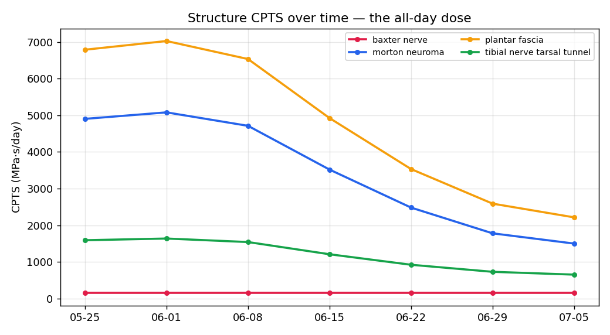

# CPTS trend — the all-day dose over time
_7 snapshots, 2026-05-25 → 2026-07-05. Watching your own numbers move is the whole point of the dose model. Not a medical device._

| structure | first | last | Δ | |
|---|---|---|---|---|
| baxter nerve | 154 | 154 | +0 (+0%) | → |
| morton neuroma | 4,901 | 1,500 | -3,401 (-69%) | 🟢 ↓ |
| plantar fascia | 6,787 | 2,215 | -4,572 (-67%) | 🟢 ↓ |
| tibial nerve tarsal tunnel | 1,591 | 653 | -938 (-59%) | 🟢 ↓ |

- forefoot dose 9,204 → 2,843 MPa·s/day; heel/mid 287 → 287.
- A falling forefoot line after a met pad / rest-window habit is the intervention working; a rising line says the dose is creeping back. Log a day.json weekly and re-chart.